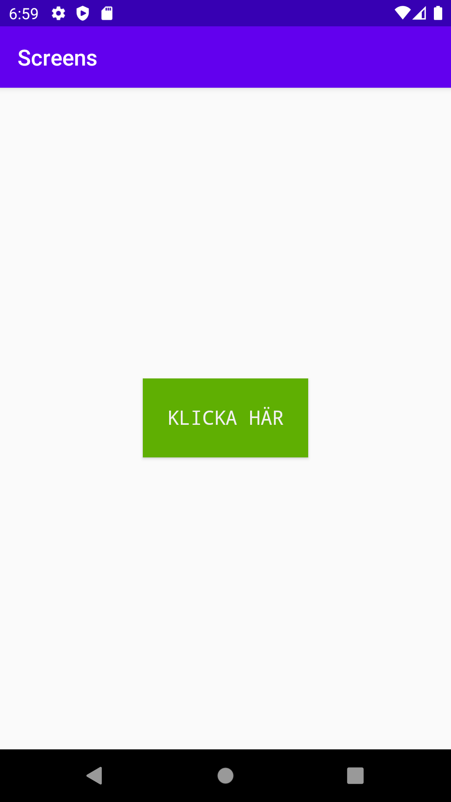
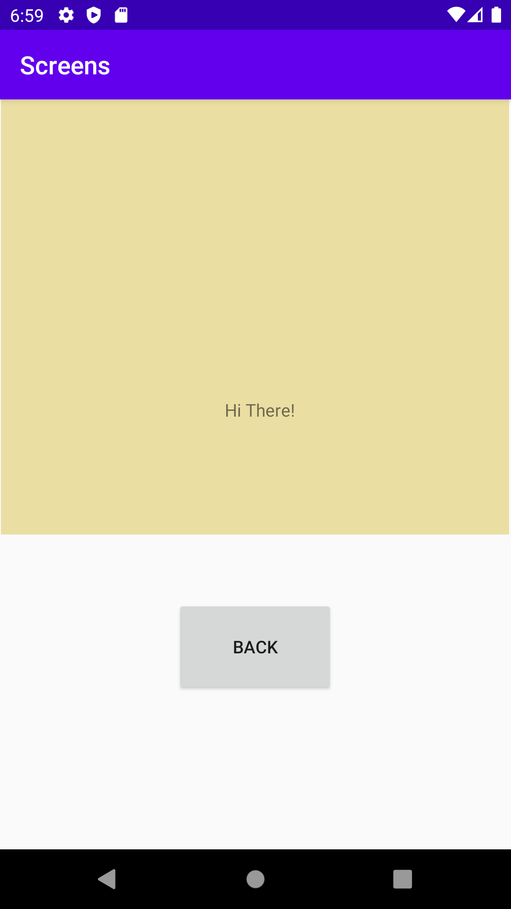

# Assignment 4: Screens


Den här duggan handlade om att skapa en screen med hjälp av fragment. I uppgiften stod att skapa ett nytt activity, båda aktiviteterna borde innehålla en knapp som gjorde det möjligt att navigera mellan första och andra activity. Andra activity borde innehålla en fragment, och fragmenten borde innehålla en widget. 
```
<?xml version="1.0" encoding="utf-8"?>
<androidx.constraintlayout.widget.ConstraintLayout xmlns:android="http://schemas.android.com/apk/res/android"
    xmlns:app="http://schemas.android.com/apk/res-auto"
    xmlns:tools="http://schemas.android.com/tools"
    android:layout_width="match_parent"
    android:layout_height="match_parent"
    tools:context=".MainActivity">

    <Button
        android:id="@+id/buttonMain"
        android:layout_width="151dp"
        android:layout_height="72dp"
        android:background="#5FAF02"
        android:fontFamily="monospace"
        android:includeFontPadding="false"
        android:text="klicka här"
        android:textColor="#F1F0F0"
        android:textSize="18sp"
        app:layout_constraintBottom_toBottomOf="parent"
        app:layout_constraintEnd_toEndOf="parent"
        app:layout_constraintStart_toStartOf="parent"
        app:layout_constraintTop_toTopOf="parent"
        app:layout_constraintVertical_bias="0.499" />
</androidx.constraintlayout.widget.ConstraintLayout>
```
```
<?xml version="1.0" encoding="utf-8"?>
<androidx.constraintlayout.widget.ConstraintLayout xmlns:android="http://schemas.android.com/apk/res/android"
    xmlns:app="http://schemas.android.com/apk/res-auto"
    xmlns:tools="http://schemas.android.com/tools"
    android:layout_width="match_parent"
    android:layout_height="match_parent"
    tools:context=".SecondActivity">

    <fragment
        android:id="@+id/fragment"
        android:name="com.example.screens.BlankFragment"
        android:layout_width="409dp"
        android:layout_height="350dp"
        android:tag="blank_fragment"
        app:layout_constraintBottom_toTopOf="@+id/buttonClose"
        app:layout_constraintEnd_toEndOf="parent"
        app:layout_constraintHorizontal_bias="0.4"
        app:layout_constraintStart_toStartOf="parent"
        app:layout_constraintTop_toTopOf="parent"
        app:layout_constraintVertical_bias="0.0" />

    <Button
        android:id="@+id/buttonClose"
        android:layout_width="128dp"
        android:layout_height="76dp"
        android:text="Back"
        app:layout_constraintBottom_toBottomOf="parent"
        app:layout_constraintEnd_toEndOf="parent"
        app:layout_constraintHorizontal_bias="0.498"
        app:layout_constraintStart_toStartOf="parent"
        app:layout_constraintTop_toTopOf="parent"
        app:layout_constraintVertical_bias="0.763" />

</androidx.constraintlayout.widget.ConstraintLayout>
```

Som ni kan se i kodan ovan jag har lagt till button view I båda activity_main.xml och activity_second.xml. Jag försökte styla lite och ge de bredd och höjd som ni kan se i koden. Jag skapade en tomt fragment och la till den till den till activity_second, och har bestämt position av det. 

I MainActivity.java och SecondActivity.java jag har lagt en setOnClickListener, för att när någon trycker på knappen de måste gå fram och tillbaka mellan de två screen som finns. I fragmenten jag la en Text view som innehåller “HI there!” 
 
```
 Button button = findViewById(R.id.buttonMain);
        button.setOnClickListener(new View.OnClickListener(){

            @Override
            public void onClick(View view) {
             Intent intent = new Intent(MainActivity.this, SecondActivity.class);
             startActivity(intent);
            }
        });
    }
```
```
  Button close = findViewById(R.id.buttonClose);
        close.setOnClickListener(new OnClickListener() {
            @Override
            public void onClick(View view) {
                finish();
            }
        });
```


